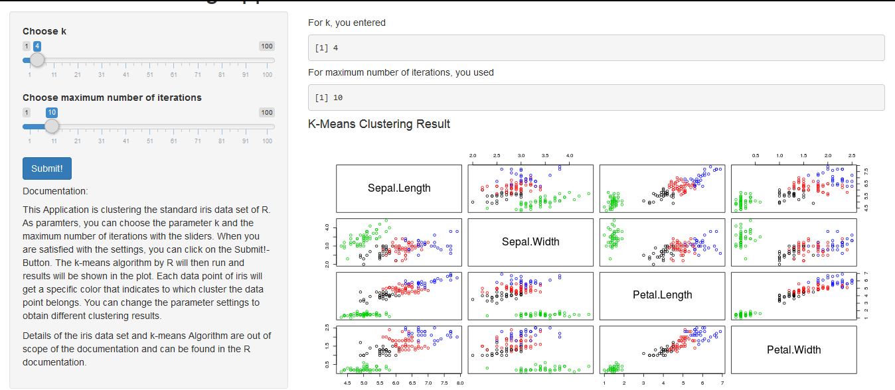
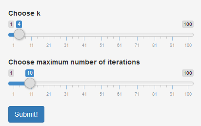
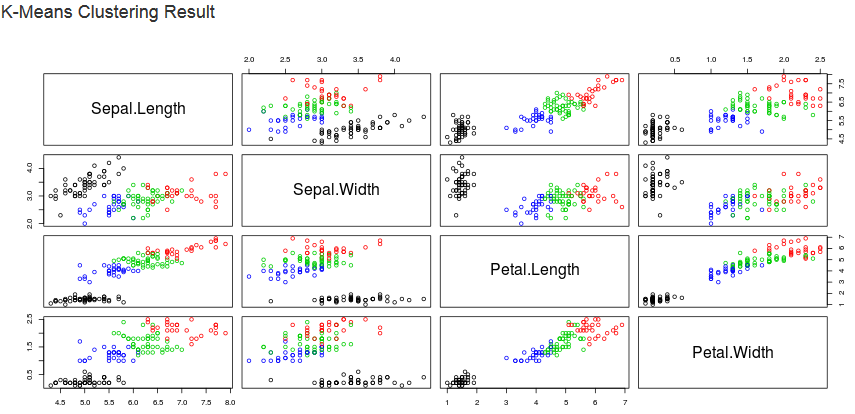

K-Means Shiny-App for the Iris Dataset
========================================================
author: F.P.
date: 04.06.2015
font-family: 'Helvetica'
transition: rotate

Summary
========================================================

The K-Means Web-Application for the Iris Data Set was created to provide biologists and other people interested in clustering the famous Edgar Anderson's Iris dataset with an easy, user-friendly way to do this. 

It has several advantages

- No R or specialized computer skills needed
- Simply can be called on the web
- Possibility to choose the number of Clusters
- Intuitive Visualization of the results

Overview
========================================================

The application can be found at:

https://flopit.shinyapps.io/KMeansApp.

How To Use 1/2
========================================================

On the left side, the input parameters can be easily set
by using the sliders.

- Choose the number of clusters
- Optionally choose maximum iterations
- Press "Submit!" Button to start computation 

How to Use 2/2
========================================================

After computation, the results are visualized in the main panel,
for all different dimensions, and can
be interpreted by the user to draw interesting conclusions.

Outlook
========================================================

If this rather simple Application is successful, it is likely that biologists
ask to have much more features included or are are interested in similar Applications
for other data sets (the sample iris set only contains 150 records) and different Algorithms to investigate their own data.
Possible future ideas are:

- Choose from different Clustering Algorithms
- Ability to upload files with data to run analysis on
- Download of results
- Creation of other 'biological' Shiny Apps 
